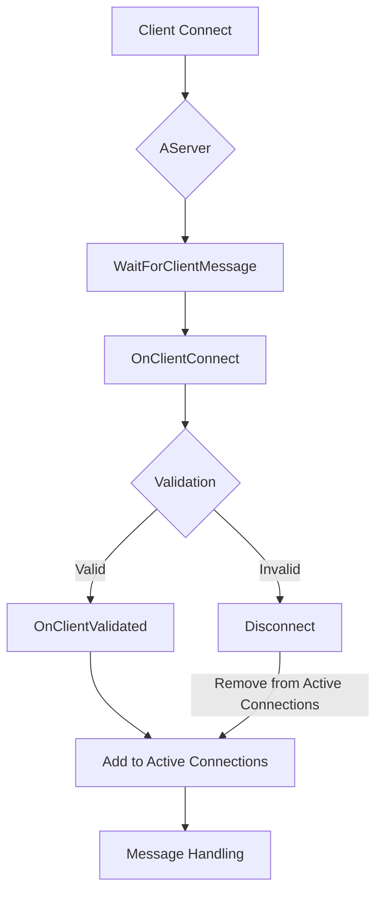

# Communication Protocol Documentation

## Overview

The communication protocol for the `R-Type` project uses the `ASIO` library for asynchronous networking and relies on UDP as the transport layer. This protocol involves client-server interactions managed by classes like `AServer` and `IClient`. The primary functions include connecting to the server, sending and receiving messages, handling disconnections, and managing game entities across clients.

### Classes and Components

- `AServer<T>`: Manages server operations, client connections, and messages.
- `IClient<T>`: Interface defining the client communication methods.
- `ThreadSafeQueue<T>`: Provides thread-safe message handling.

## Connection Flow



### Server Operations (`AServer<T>` Class)

The `AServer` class handles the following:

- Connect (`Connect(host, port)`):
  - Initializes server with specified `port`.
  - Uses ASIO to create a UDP socket for asynchronous operations.
- Message Handling (`OnMessage(client, msg)`):
  - Processes incoming messages and dispatches responses.
  - Uses `ThreadSafeQueue` to manage messages.
- Entity Management:
  - Manages game entities' states and synchronization across clients.
  - Updates client views on player positions and game state changes.

#### Server Key Functions

- `OnClientConnect(client)`: Validates and accepts a client connection.
- `OnClientDisconnect(client)`: Handles client disconnection.
- `WaitForClientMessage()`: Listens for messages asynchronously from connected clients.
- `MessageAllClients(msg, pIgnoreClient)`: Broadcasts messages to all clients.
- `MessageClient(client, msg)`: Sends a message to a specific client.

### Client Operations (`IClient<T>` Interface)

The IClient interface outlines methods for client-side operations.

1. Connect (`Connect(host, port)`):
   - Connects the client to a specified host and port over UDP.
1. Send Message (`Send(msg)`):
   - Sends a message to the server.
1. Receive Messages (`Incoming()`):
   - Receives and processes incoming messages.

#### Client Key Functions

- `IsConnected()`: Checks if the client is currently connected.
- `Disconnect()`: Disconnects the client from the server.

## Message Structure

Each message consists of the following parts:

1. **Message ID** (uint32): Identifies the type of message.
2. **Payload**: Contains specific data fields based on the message type. Fields are detailed below for each message.

## Client-Server Protocol Overview

### 1. Introduction

This document outlines the protocol used for communication between the Client and the Server. It details the request and response messages, including the format, message types, and the flow of communication.

## 2. Architecture Overview

```cpp
vf2d:
    float x // 4 bits
    float y // 4 bits

EntityInformation:
    uint32_t nUniqueID // 4 bits
    uint32_t nAvatarID // 4 bits
    vf2d vPosition

entityId:
    uint32_t id // 4 bit
```

| Message Part | Description        |
| ------------ | ------------------ |
| **Headers**  | Required headers   |
| **Body**     | Optional body text |

---

### Dead Entity Message Exchange

This table represents a communication where the client sends and receives a message about a dead entity:

| Client                       | Transmission     | Server                      |
| ---------------------------- | ---------------- | --------------------------- |
|                              | Send             |                             |
| process message              | <--------------- | header: `DeadEntityMessage` |
|                              |                  | body: `entityId`            |
|                              | Response         |                             |
| header: `DeadEntityResponse` | ---------------> |                             |
| body: ``                     |                  |                             |

**Transmission**: The server sends a `DeadEntityMessage` to the client, containing information about an entity (in `entityId` format) that is dead.
**Response**: The client processes the message and responds back to the server with the `DeadEntityResponse` type of message with an empty body to confirm reception.

---

### Create Entity Message Exchange

This table depicts a communication where the server requests the creation of an entity:

| Client                         | Transmission     | Server                        |
| ------------------------------ | ---------------- | ----------------------------- |
|                                | Send             |                               |
| process message                | <--------------- | header: `CreateEntityMessage` |
|                                |                  | body: `EntityInformation`     |
|                                | Response         |                               |
| header: `CreateEntityResponse` | ---------------> |                               |
| body: ``                       |                  |                               |

**Transmission**: The server sends a `CreateEntityMessage` to the client, which includes entity creation data in `EntityInformation`.
**Response**: The client processes the message and sends a confirmation response back with the `CreateEntityResponse` message type.

---

### Move Entity Message Exchange

This table outlines the communication flow for moving an entity:

| Client          | Transmission     | Server                    |
| --------------- | ---------------- | ------------------------- |
|                 | Send             |                           |
| process message | <--------------- | header: `UpdateEntity`    |
|                 |                  | body: `EntityInformation` |

**Transmission**: The server sends a `UpdateEntity` to the client, containing data (in `EntityInformation` format) about an entity that needs to be moved.
**Response**: The client processes the message but does not send a response back in this table.

---

### Move Player Message Exchange

| Client                      | Transmission     | Server                    |
| --------------------------- | ---------------- | ------------------------- |
| header: `MoveEntityMessage` | Send             |                           |
| bode: `vf2d`                | ---------------> | process                   |
|                             | Send             |                           |
| process message             | <--------------- | header: `UpdateEntity`    |
|                             |                  | body: `EntityInformation` |

**Transmission**: The Client sends a `MoveEntityMessage` to the Server, containing data (in `vf2d` format) about an entity that needs to be moved.
**Response**: The server processes the request and returns an `UpdateEntity` message containing the entity's information (in `EntityInformation` format), provided that no collision error is detected.

---

<!-- ### Fire Bullet Message Exchange -->

<!-- This table represents the process for handling bullet firing events between the client and server: -->

<!-- |         Client            | Transmission     |          Server           | -->
<!-- |---------------------------|------------------|---------------------------| -->
<!-- |                           |       Send       |                           | -->
<!-- | header: `FireBulletMessage` | ---------------> |  process message          | -->
<!-- | body: `entityInfo_t`        |                  |                           | -->
<!-- |                           |     Response     |                           | -->
<!-- |                           | <--------------- | header: `FireBulletResponse` | -->
<!-- |                           |                  | body: `entityInfo_t`        | -->

<!-- **Transmission**: The client sends a `FireBulletMessage` with data about a bullet (in `entityInfo_t` format) to the server. -->
<!-- **Response**: The server processes the message and responds with a confirmation `FireBulletResponse`, which the client then receives. -->

---
