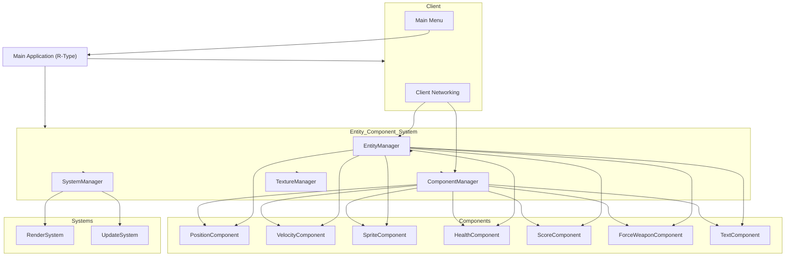
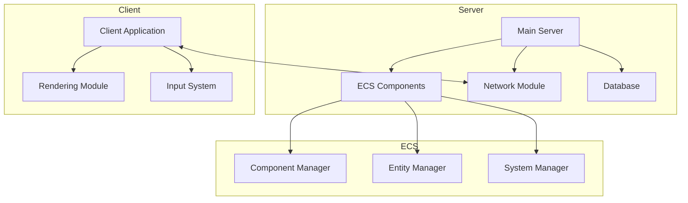
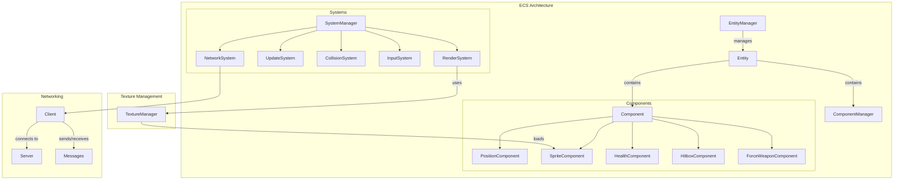
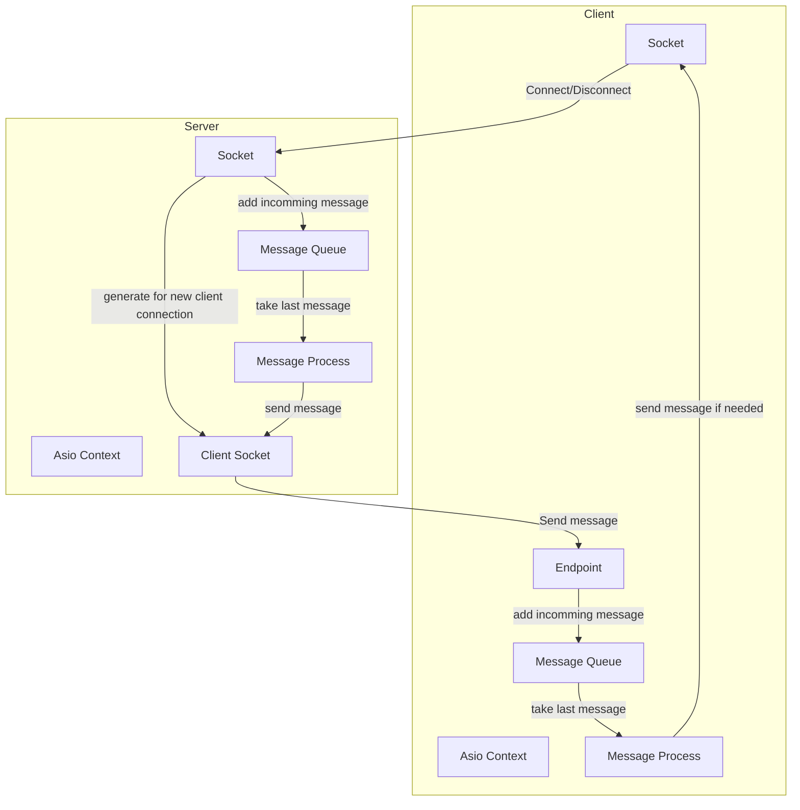
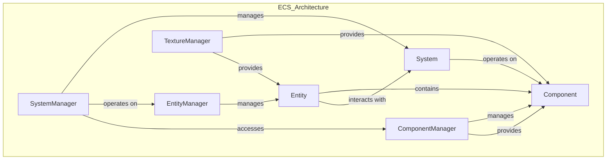
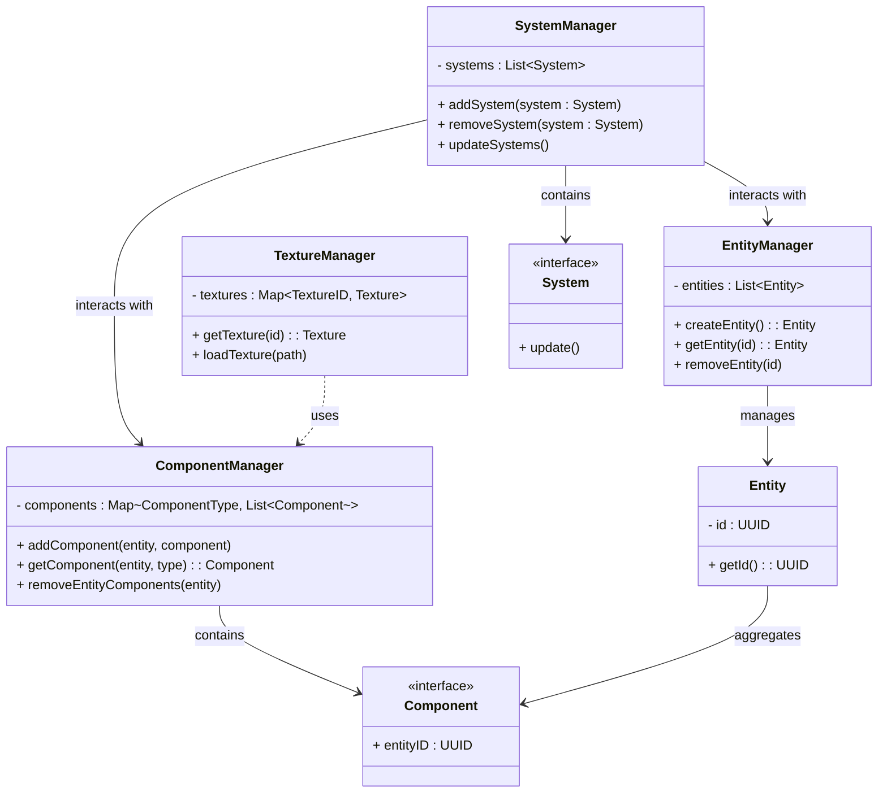
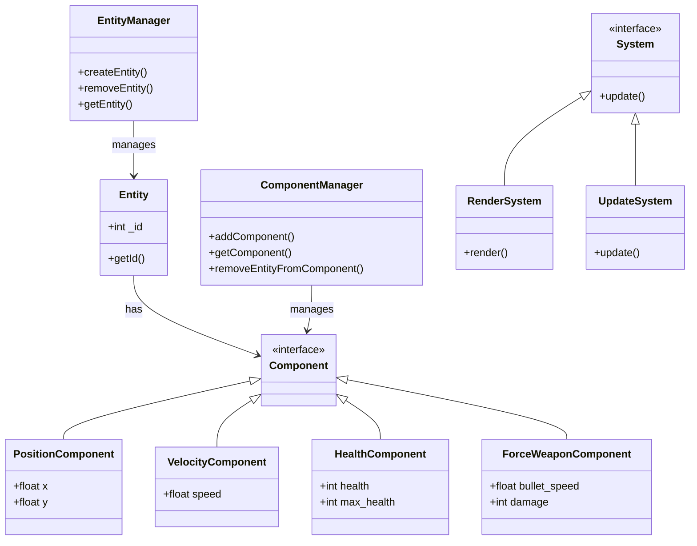

# Developer Documentation

## Standard

**Formatter**: Clang with config
**Folder Name:** PascalCase
**File Name:**  snake\_case

**Code**:

- **Class:** PascalCase
- **Function:** camelCase
- **Variable:** camelCase
- **Comment:** Above function & next to line (right side)

**Commit:** gc \-m "\[TITLE\] name of changed item" \-m "description"

- **ADD:** Add a feature
- **UPD:** Update/modify a feature
- **FIX:** Fix an error
- **DEL**: Delete a file/folder
- **MERGE**

## CI / CD

github action cache:

- use documentation: [Github Action Cache](https://docs.github.com/en/actions/writing-workflows/choosing-what-your-workflow-does/caching-dependencies-to-speed-up-workflows#comparing-artifacts-and-dependency-caching)

auto-format:

- use git-auto-commit-action:
  - documentation: [git-auto-commit-action](https://github.com/stefanzweifel/git-auto-commit-action)

## Dev Container

on linux with X11

```bash
xhost local:root
```

open the dev container with visual studio code

## Archi

### Global




This schema depicts the core architecture:

- **Entity Component System**: Contains the primary managers (EntityManager, ComponentManager, SystemManager, and TextureManager).
- **Components**: Represents individual components such as Position, Velocity, Sprite, Health, Score, Weapon, and Text.
- **Systems**: Systems like RenderSystem and UpdateSystem operate on the entities and components.
- **Client**: Manages client networking and interfaces such as the main menu, connecting it to the ECS.

Let me know if any specific details or additional components need to be included!


### Server




This structure:

1. **Server** has subsystems for managing entities and components via ECS.
2. **Client** communicates with the server's network module and has separate modules for rendering and input.
3. **Database** holds persistent data shared with the main server.

You can adapt this further with more specific ECS details or add networking protocols if needed. Let me know if you'd like modifications!


### Client



In this diagram:

-  **EntityManager** manages entities.
-  **ComponentManager** contains various components that define entity attributes.
-  **SystemManager** oversees systems that execute game logic (e.g., `RenderSystem` for rendering, `UpdateSystem` for game state, `CollisionSystem` for collisions, etc.).
-  **TextureManager** loads textures used by RenderSystem.
-  **NetworkSystem** handles networking with the server, where `Client` connects to `Server`.

### Network



### ECS - System



This structure represents the core relations among the elements in your ECS setup. The **EntityManager** and **ComponentManager** handle entities and components, respectively, while the **SystemManager** coordinates systems, which interact with entities and components as needed. The **TextureManager** is specific to components, aiding with graphics rendering.


### Entities




This schema provides a visual overview of how different managers in the ECS work together within the R-Type architecture. The relationships show `EntityManager` managing `Entity` instances, `ComponentManager` handling the `Component` instances, and `SystemManager` managing `System` instances, which interact with both managers to perform updates&#8203;:contentReference[oaicite:0]{index=0}.


### Componant


