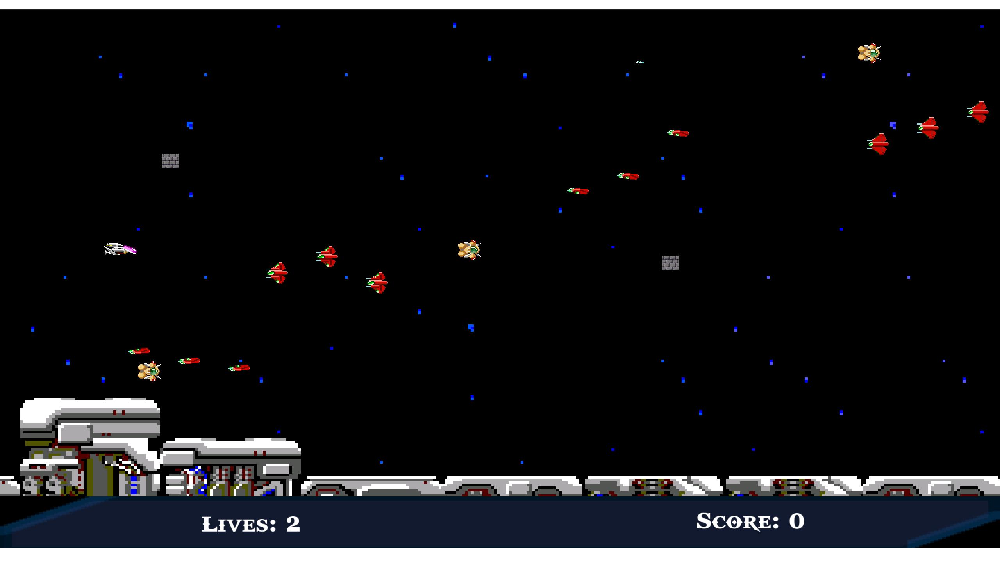

# R-Type

## Authors

- [@Alea Chlodnik](https://www.github.com/AleaChlodnik)
- [@Marc.dva](https://www.github.com/Dvaking)
- [@QuentinLeguay](https://www.github.com/QuentinLeguay)
- [@Tom-Mendy](https://www.github.com/Tom-Mendy)

## Table of Contents

- [R-Type](#r-type)
  - [Authors](#authors)
  - [Table of Contents](#table-of-contents)
  - [General Info](#general-info)
  - [Features](#features)
  - [Usage/Examples](#usageexamples)
    - [Server](#server)
    - [Client](#client)
  - [Installation](#installation)
    - [Linux](#linux)
      - [NixOS](#nixos)
    - [Windows](#windows)
  - [Documentation](#documentation)
  - [Tech Stack](#tech-stack)
  - [Running Tests](#running-tests)
  - [Contributing](#contributing)
  - [Acknowledgements](#acknowledgements)
  - [Screenshots](#screenshots)

## General Info

R-Type is a classic side-scrolling shoot 'em up game where players pilot a spaceship to battle waves of alien enemies and bosses.

## Features

- UDP protocol
- server / client app

## Usage/Examples

### Server

```bash
./r-type_server <port>
```

### Client

```bash
./r-type_client <server ip> <port>
```

## Installation

### Linux

Build r-type_client & r-type_server with CMake

```bash
cmake -S . -B build && cmake --build build -j "$(nproc)"
```

#### NixOS

Build r-type_client & r-type_server with CMake on nixOS

```bash
nix develop --command bash -c 'cmake -S . -B build && cmake --build build -j "$(nproc)"'
```

### Windows

Install [Visual Studio](https://visualstudio.microsoft.com/), [CMake](https://cmake.org/download/) and [g++](https://sourceforge.net/projects/mingw/)

Build r-type_client & r-type_server with CMake

```cmd
cmake -S . -B build
cmake --build build -- /maxcpucount:4
```

## Documentation

[Developer Documentation](./Docs/DeveloperDocumentation.md)

[Protocol Documentation](./Docs/CommunicationProtocol.md)

[Comparative Study Documentation](./Docs/ComparativeStudy.md)

[Architecture Documentation](./doc_doxygen/html/index.html)

## Tech Stack

**Client:** [C++](https://en.wikipedia.org/wiki/C++), [SFML](https://www.sfml-dev.org/), [ASIO](https://think-async.com/Asio/)

**Server:** [C++](https://en.wikipedia.org/wiki/C++), [ASIO](https://think-async.com/Asio/)

## Running Tests

To run tests, run the following command

<!-- ```bash
  npm run test
``` -->

## Contributing

Contributions are always welcome!

See `contributing.md` for ways to get started.

Please adhere to this project's `code of conduct`.

## Acknowledgements

<!-- - [Awesome Readme Templates](https://awesomeopensource.com/project/elangosundar/awesome-README-templates)
- [Awesome README](https://github.com/matiassingers/awesome-readme)
- [How to write a Good readme](https://bulldogjob.com/news/449-how-to-write-a-good-readme-for-your-github-project) -->

## Screenshots


